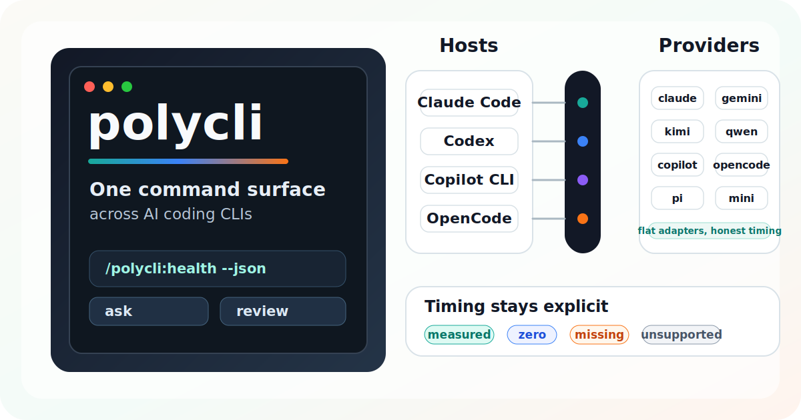

<div align="center">



# polycli

**在你已经在用的 AI host 里，用一套命令驱动 11 个 AI coding CLI。**

[](https://github.com/bbingz/polycli/releases)
[](https://github.com/bbingz/polycli/actions/workflows/ci.yml)
[](https://www.npmjs.com/package/@bbingz/polycli)
[](https://www.npmjs.com/package/@bbingz/polycli-opencode)
[](https://www.npmjs.com/package/@bbingz/polycli-utils)
[](https://www.npmjs.com/package/@bbingz/polycli-timing)
[](./LICENSE)
[](https://nodejs.org)

[English](./README.md) · **简体中文** · [日本語](./README.ja.md)

</div>

---

## polycli 是什么？

`polycli` 让你在 Claude Code、Codex、GitHub Copilot CLI 或 OpenCode 中，用同一套命令（`health`、`ask`、`review`、`rescue`、`timing`、`debug`，以及后台作业管控和终端 inspector）驱动 11 个 AI coding CLI：**`claude`**、**`gemini`**、**`kimi`**、**`qwen`**、**`copilot`**、**`opencode`**、**`pi`**、**`cmd`**（Command Code）、**`agy`**（Antigravity）、**`grok`**（xAI Grok）和 **`mmx-cli`**（MiniMax）。

这是一个 **utility-only 的 Path B monorepo**：不假装能抹平 provider 之间的差异，也不引入 runtime 基类。它把官方上游 CLI 作为子进程组合起来，统一命令面，并通过四态 timing schema 如实暴露能力差异。

## 最新版本：v0.6.31

本次 review-remediation 发布保持 agent-native control plane 和 Path B 边界，同时关闭 v0.6.30 后全面 review 确认的 14 个问题：provider 执行新增有界输出、类型化失败、安全 stdin/argv 传输、POSIX 进程组升级终止与可信 session identity；后台启动、取消、SessionEnd、恢复 sidecar 和 terminal ledger 发布在失败及竞态下保持可恢复；no-change JSON v2、provider 目标解析、TUI effects、active-job 状态和 ledger preview 均返回权威且脱敏的事实；source-derived validator 会在任何原地构建前校验五份 companion bundle 和 terminal metadata。

发布说明：[English](./docs/release-notes-v0.6.31.md) · **[简体中文](./docs/release-notes-v0.6.31.zh-CN.md)** · [日本語](./docs/release-notes-v0.6.31.ja.md)。

## 为什么要用 polycli？

大多数"多 AI 编排器"为了凑出统一 API，会对能力差异说谎。polycli 反着来：

- **诚实的 4 态 timing** —— 每个指标都是 `measured`、`zero`、`missing` 或 `unsupported`，绝不折叠。你永远清楚是哪个 provider 没法测，还是哪个只是恰好没数据，或是恰好贡献了 0。
- **不假装统一** —— provider 之间的差异（session resume、tool 支持、结构化输出）写在 capability matrix 里明示，不用胶水代码遮掩。
- **直通 CLI** —— 直接 spawn 官方 CLI（`gemini`、`kimi` 等）作为子进程。复用你本机已有的登录态和配置；polycli 不收集、不上传、不托管 API key。
- **多 host、单一命令面** —— 同一套命令在 Claude Code、Codex、Copilot CLI、OpenCode 都生效。换 host 不用重学。

## Host 和 Provider

| Host（polycli 安装在哪里） | Provider（polycli 能调什么） |
|---|---|
| Claude Code · Codex · GitHub Copilot CLI · OpenCode | `claude` · `copilot` · `gemini` · `kimi` · `qwen` · `opencode` · `pi` · `cmd` · `agy` · `grok` · `minimax` (`mmx-cli`) |

各 provider 支持的能力详见 [Capability matrix](#capability-matrix)。

## 安装

### Claude Code

```bash
claude plugin marketplace add bbingz/polycli
claude plugin install polycli@polycli-hosts
```

### Codex

```bash
codex plugin marketplace add bbingz/polycli
```

然后打开新的 Codex TUI 会话，运行 `/plugins`，从 `polycli-hosts` marketplace 安装或启用 `Polycli`，再开一个新会话让 skill 列表刷新。

### GitHub Copilot CLI

```bash
copilot plugin marketplace add bbingz/polycli
copilot plugin install polycli-copilot@polycli-hosts
```

### OpenCode

```bash
opencode plugin @bbingz/polycli-opencode
```

## 快速上手

装完之后在 host 里验证：

> **polycli 优先是 in-host plugin，也提供可选终端 CLI。** 每个 host 适配器在该 host 自己的命令体系里暴露同一套 `health / ask / review / rescue / timing / debug / sessions` 词汇；不在这 4 个 host 内时，可以安装 `@bbingz/polycli` 获得 PATH 可调用的 `polycli` wrapper。见英文 README 的 [Outside a supported host](./README.md#outside-a-supported-host) 段。

```text
# Claude Code（slash command）
/polycli:health

# Codex（已安装 skill，不是 slash command）
Choose Polycli with @, then ask it to run: health

# GitHub Copilot CLI（在 copilot prompt 里的 skill 词）
polycli health

# OpenCode（tool 调用 — 调 polycli_run 传 ["health","--json"]）

# Terminal CLI（可选 PATH 二进制）
polycli health
```

`health` 会对已认证的 provider 跑探针，并把存活的列在 `healthyProviders` 里。Claude 是例外：它只调用 `claude auth status --json`，不会发送健康检查 prompt。之后日常使用就直接调：

```text
Choose Polycli with @, then ask it to run: ask --provider qwen "解释这个 stack trace ..."
Choose Polycli with @, then ask it to run: review --provider claude --scope staged
Choose Polycli with @, then ask it to run: rescue --provider gemini --background "..."
```

长任务加 `--background`，再用 `status <jobId>` / `result <jobId>` 取结果。

## 核心命令

所有命令在每个 host 行为一致：

| 命令 | 作用 |
|---|---|
| `setup` | 检查 provider CLI 安装与 status 型认证；可能发送模型 prompt 的认证探测需显式加 `--probe-auth` |
| `health` | 除 Claude 外的端到端短 prompt 探针；Claude 使用 auth-only status；返回 `healthyProviders` 并在适用时写入 timing |
| `ask` | 单次提问 |
| `review` | 基于当前 `git diff` 做代码审查 |
| `rescue` | 较长的排障 / 分析任务 |
| `adversarial-review` | 偏攻击面的审查 |
| `timing` | 查看 timing 历史和聚合 |
| `debug` | 查看 redacted run ledger：`runs` / `show` / `explain` |
| `sessions` | 列出或按 `--confirm` 清理 polycli 记录过的上游 session artifact |
| `tui` | 只读终端 inspector，渲染 run ledger / debug 数据 |
| `status` / `result` / `cancel` | 后台 job 控制 |

只在以下情况跑 `health`：(a) 第一次接入某个 provider，(b) 认证状态变了，(c) 某个 provider 命令失败。日常使用不需要每次先跑。

## Capability matrix

事实来源：[`packages/polycli-runtime/src/registry.js`](./packages/polycli-runtime/src/registry.js) 的 `RUNTIMES` + `TIMING_SUPPORT`。`✓` = 支持；`—` = 设计上不适用（在 timing 里报 `unsupported`，不会假装成 `missing` 或 `0`）。

| Provider | streaming | sessionResume | structuredOutput | ttft | gen | tail | tool |
|---|:---:|:---:|:---:|:---:|:---:|:---:|:---:|
| `claude` | ✓ | ✓ | ✓ | ✓ | ✓ | ✓ | — |
| `copilot` | ✓ | ✓ | ✓ | ✓ | ✓ | ✓ | — |
| `gemini` | ✓ | ✓ | ✓ | ✓ | ✓ | ✓ | — |
| `kimi` | ✓ | ✓ | ✓ | ✓ | ✓ | ✓ | — |
| `qwen` | ✓ | ✓ | ✓ | ✓ | ✓ | ✓ | ✓ |
| `minimax` (`mmx-cli`) | ✓ | — | ✓ | — | — | — | — |
| `opencode` | ✓ | ✓ | ✓ | ✓ | ✓ | ✓ | — |
| `pi` | ✓ | ✓ | ✓ | ✓ | ✓ | ✓ | — |
| `cmd` | ✓ | — | — | ✓ | ✓ | ✓ | — |
| `agy` | ✓ | ✓ | — | ✓ | ✓ | ✓ | — |
| `grok` | ✓ | ✓ | ✓ | ✓ | ✓ | ✓ | — |

说明：

- `cold` 和 `retry` 对所有 provider 都是 `unsupported`：上游 CLI 没有稳定信号，polycli 拒绝伪造。`total` 永远是 `measured`。
- `claude` 的 `ask` / `review` 默认走 headless `claude -p`，并保留 plan/no-tools/no-MCP 约束，所以会返回同步模型答案和可测的 streaming timing。runtime 仍保留 detached tmux TUI 作为显式/内部路径；该模式下 `ttft` / `gen` / `tail` 会报 `unsupported`，`total` 只测 tmux 启动和 prompt 提交，响应里会包含 `tmuxSession` + `attachCommand`。
- `minimax` 走 `mmx-cli` 非交互 JSON 调用，不支持 session resume、不支持细粒度 streaming timing。`cmd` 走 Command Code 官方 headless 模式，每次调用都是 standalone session，stdout 就是可见答案。`agy` 走 Antigravity session 模式但输出是纯文本；`grok` 走 xAI Grok Build CLI。
- 只有 `qwen` 声明 `tool: true`。当 `qwen` 没触发 tool 调用时报 `missing`（可观测但本次未发生），其他 provider 报 `unsupported`（能力上不跟踪）。两个状态语义不同，不要合并。

## Timing 语义

polycli 的 timing 契约统一的是**状态表达**，不是数值。每个指标都明确标记为四种状态之一：

| 状态 | 含义 |
|---|---|
| `measured` | 真实非零的数据 |
| `zero` | 明确贡献了 0 |
| `missing` | 理论上能测，但本次没拿到 |
| `unsupported` | provider / runtime 根本不具备这个指标 |

这样跨 provider 比较时，"没能力"、"没数据"、"贡献 0" 不会被混进同一列。

每条 timing 记录还带：

- `runtimePersistence` —— `ephemeral | session | daemon`
- `measurementScope` —— `request | turn | job`
- outcome diagnostics —— `outcome`, `exitCode`, `terminationReason`, `responseMatched`, and `errorCode`
- `kind` 与可选 outcome diagnostics 会参与聚合 cohort。百分位数只在 `provider + kind + measurementScope + outcome + runtimePersistence` 完全一致的 cohort 内可比较；兼容保留的 `byProvider` JSON 汇总会给出 `cohortCount` 和 `mixedDimensions`，一旦存在 mixed dimensions，就不要把其中汇总的百分位数当作可比较结果。

## Packages

| Package | 用途 |
|---|---|
| [`@bbingz/polycli`](./packages/polycli-terminal) | PATH 可调用的终端 CLI wrapper，包含只读 `polycli tui` inspector |
| [`@bbingz/polycli-utils`](./packages/polycli-utils) | 参数解析、进程执行、stream 解码、NDJSON、原子保存、session id、stream JSON 解析 |
| [`@bbingz/polycli-timing`](./packages/polycli-timing) | timing schema、运行时校验、百分位、capability-aware 聚合 |
| [`@bbingz/polycli-runtime`](./packages/polycli-runtime) | provider registry、可用性 / 认证探针、命令构造器、前台 / streaming 执行、stream / log 解析 |

Plugin 发布产物：

- [`plugins/polycli`](./plugins/polycli) —— Claude Code host 插件
- [`plugins/polycli-codex`](./plugins/polycli-codex) —— Codex
- [`plugins/polycli-copilot`](./plugins/polycli-copilot) —— GitHub Copilot CLI
- [`plugins/polycli-opencode`](./plugins/polycli-opencode) —— OpenCode

## 开发

要求：Node.js `>=20`。

```bash
npm install
npm test                                       # build:plugins + 全量测试
node --test packages/polycli-runtime/test/     # 单 package 聚焦测试
npm run build:plugins                          # 重新打包 plugin 产物
npm run release:check                          # 发布前校验
```

`npm test` 已经会先跑 `build:plugins`，**不要**手动先 build 再 test。

## 发布

发布流程：[`docs/release.md`](./docs/release.md)。各版本 release notes：[`docs/release-notes-*.md`](./docs/)。

## 架构与贡献

提 PR 之前请读：

- [`CONTRIBUTING.md`](./CONTRIBUTING.md) —— 贡献流程与 release-facing 检查
- [`AGENTS.md`](./AGENTS.md) —— 仓库地图、编辑规则、交付预期
- [`CLAUDE.md`](./CLAUDE.md) —— Claude Code 专属补丁
- [`docs/polycli-proposal.md`](./docs/polycli-proposal.md) —— 主要架构 / 产品上下文
- [`docs/roadmap.md`](./docs/roadmap.md) —— 实时进度清单

安全问题报告：见 [`SECURITY.md`](./SECURITY.md)。

硬架构约束（请遵守）：

- provider-specific 协议解析放在 `polycli-runtime`，**不要**移到 `polycli-utils`。
- 四态 timing 不可折叠。`cold` 和 `retry` 故意不实现（上游 CLI 无稳定信号）。
- legacy 仓库（`gemini-plugin-cc` / `qwen-plugin-cc` / `kimi-plugin-cc` / `minimax-plugin-cc`）作为只读 reference 保留 —— 允许 `grep` 对比，不要编辑。

## License

[MIT](./LICENSE) —— 详见 [`LICENSE`](./LICENSE) 与各 package 的 [`packages/*/package.json`](./packages/) 元数据。
